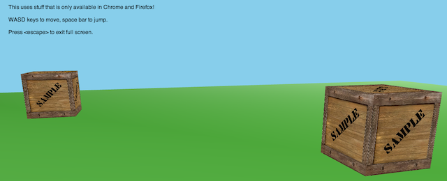

# elm-maze-war
*An implementation of Maze War in Elm*

Check out [my blog](http://genthaler.github.io) for the story of its creation!

Make sure you have the latest version of Chrome or Firefox and then click the
following image to try out the **[live demo][demo]**:

[][demo]

[demo]: http://genthaler.github.io/elm-maze-war

## Build Locally

After installing [the Elm Platform](https://github.com/elm-lang/elm-platform),
run the following sequence of commands:

```bash
git clone https://github.com/genthaler/elm-maze-war.git
cd elm-maze-war
elm package install
elm reactor
```

And then open [http://localhost:8000](http://localhost:8000) to see it in action!
